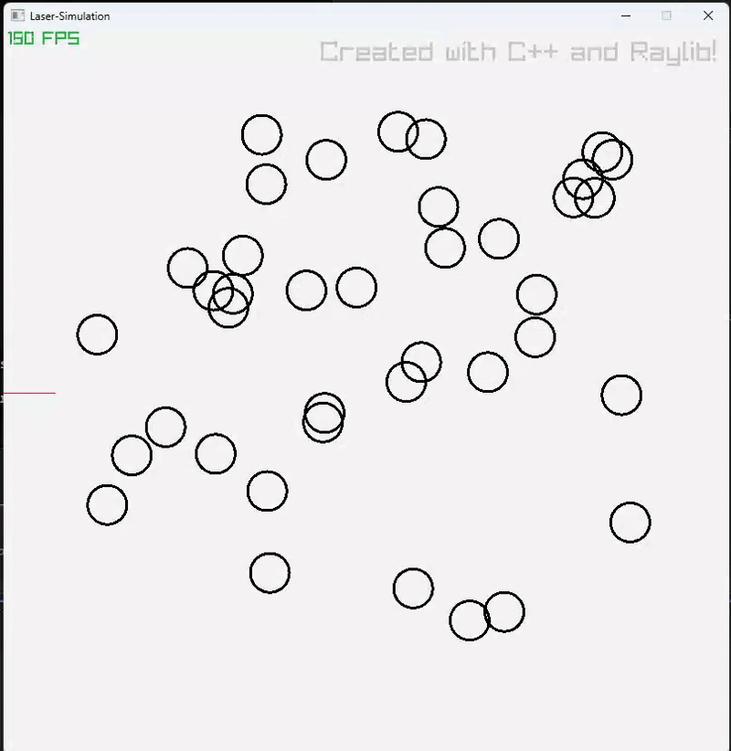

# Laser-OpenGL

<h>I saw a video on the internet of a program like this a couple years back and wanted to take a shot at it</h>

 I also felt that it would be a good step away from the python barnes-hut program. Additionally it functions as a nice step into C++

  

